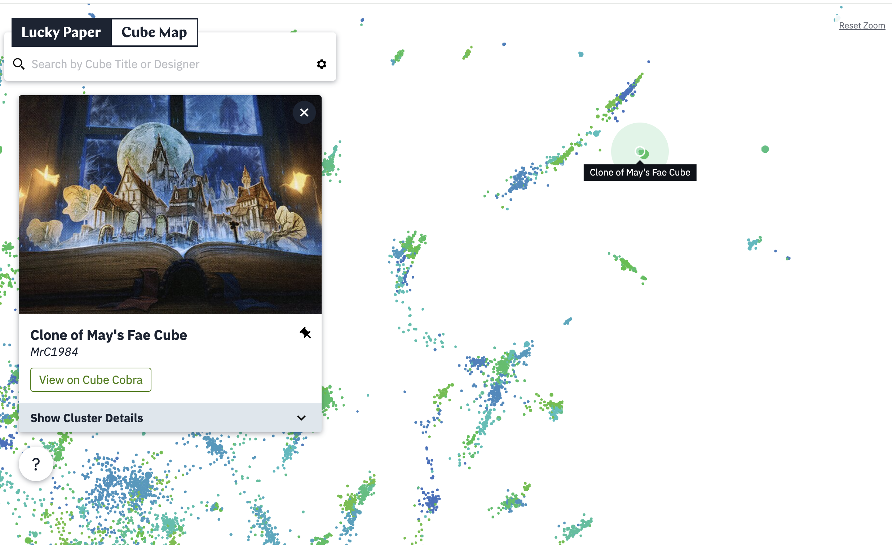
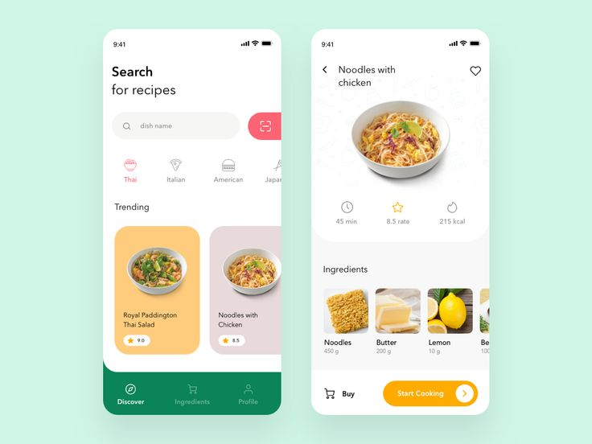
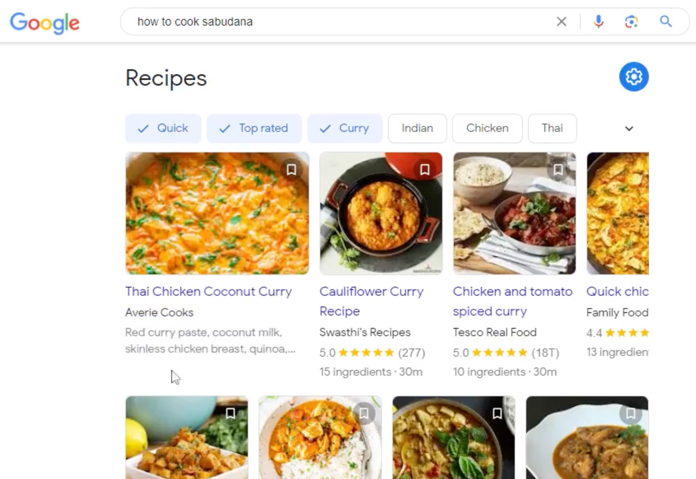

# Project of Data Visualization (COM-480)
## TastingViz

| Student's name       | SCIPER   | Email                        |
| -------------------- | -------- | ---------------------------- |
| Vivien Gaillet       |          | vi.gaillet@gmail.com          |
| Oliver Sorrentino    | 341207   | oliver.sorrentino@epfl.ch     |
| Dana Shayakhmetova   | 388763   | dana.shayakhmetova@epfl.ch    |

[Milestone 1](https://github.com/com-480-data-visualization/com-480-project-TastingViz/tree/master/Milestone1) • [Milestone 2](https://github.com/com-480-data-visualization/com-480-project-TastingViz/tree/master/Milestone2) • [Milestone 3](#milestone-3)

## Milestone 1 (21st March, 5pm)

**10% of the final grade**

This is a preliminary milestone to let you set up goals for your final project and assess the feasibility of your ideas.
Please, fill the following sections about your project.

*(max. 2000 characters per section)*

### Dataset

We have chosen to work with CulinaryDB, which is a structured dataset containing recipes and ingredients for over 22 world regions.

Luckily, the data is of good quality and doesn't need any data-cleaning. However, one issue we might face during our project is the variation in ingredient names due to synonyms. To avoid this, we plan on using the unique ID associated with each  ingredient. 

Only minimal preprocessing is needed, such as removing unnecessary columns and merging the required ones to identify ingredient IDs and names.
CulinaryDB dataset : [Link](https://cosylab.iiitd.edu.in/culinarydb/#databasedescription)

### Problematic

Food is a central part of our world, and understanding the ingredients that define each culture is important to improve our culinary knowledge. Our project aims to visualize the most commonly used ingredients per country and help users find recipes based on their available ingredients in the fridge. 

Tasting Viz will be designed to create an intuitive, visually engaging platform for novice cooks to explore recipes based on the ingredients they have in their fridge, discover new dishes, and develop basic cooking skills.

But before cooking, research is key.  Our website will provide visual insights into our database, highlighting various cooking cultures, the most commonly used ingredients across different cuisines, and much more. Once users gain a solid understanding, they can begin their learning journey by choosing recipes. 

Through this work, our website will answer the users’ following questions: What are the most used ingredients around the world ? How do ingredients relate to one another ? What recipes can be made with specific ingredients? What recipe is the most similar to the one I liked? … and many more. 

As mentioned before, the motivation behind this project is to bridge the gap between ingredient knowledge and culinary skills, making cooking more accessible, exciting, and educational. The target audience includes beginners eager to learn efficient cooking, food enthusiasts looking for inspiration, and anyone aiming to reduce food waste by using ingredients they already have.

### Exploratory Data Analysis

We focused on preprocessing the data by removing ingredients used fewer than once and excluding recipes with fewer than three ingredients. We also explored basic statistics and visualized key trends within the dataset. For a detailed view of our code, graphs, and further analysis, please refer to the "eda" notebook in our repository.

[Noteboook Link](https://github.com/com-480-data-visualization/com-480-project-TastingViz/blob/master/Milestone1/eda.ipynb)

### Related work

#### What others have already done with the data?

Most of the previous work on this dataset was done by its original creators. For example, they calculated food pairing scores to compare how well different cuisines pair with each other. Additionally, they performed basic statistics, such as showing the recipe size distribution across different regions, which is a standard practice when starting data analysis.

#### Why is your approach original?

To make recipe selection easier and our approach more unique, we will incorporate a search feature that uses our recipe, ingredient, and compound ingredient data. Users can input the ingredients in their fridge or pantry to receive recipe suggestions. Additionally, if you're a picky eater and enjoy a certain recipe, you can search for its closest ingredient neighbors (like cluster) to discover similar ones. 

#### What source of inspiration do you take?

Our inspiration comes from a variety of sources, both related and unrelated to cooking.

For our ingredient search tool, we aim to create something similar to the functionality below, but with a more visually appealing design: [source link](https://www.reciperadar.com/)

  

  

We propose a feature that helps users find similar recipes based on their preferences. When users click on a specific point in the cluster (shown below), a recipe card with the recipe and ingredients will appear, similar to the one on the left.

  

Other idea to search through the recipes by recipes or ingredients :  [source 1 link](https://www.pinterest.com/pin/recipe-app-design--791296597023662453/) [source 2 link](https://www.seroundtable.com/google-new-recipe-search-interface-36038.html)

  

  

Overall, we want our website design to be simple, welcoming, and engaging, similar to the design below: [source link](https://dribbble.com/shots/14787532-Weather-Forecast-Dashboard)

  

## Milestone 2 (18th April, 5pm)

**10% of the final grade**

Link to website skeleton: [TastingViz Website Skeleton](https://com-480-data-visualization.github.io/com-480-project-TastingViz/)

Milestone 2 Text Document: [Link to PDF](https://github.com/com-480-data-visualization/com-480-project-TastingViz/blob/master/Milestone2/Milestone2.pdf)

## Milestone 3 (30th May, 5pm)

**80% of the final grade**

### Technical setup
Index.html is the main html file of our website.
Our Dataset is in the CulinaryDB file and is : 01_Recipe_Details.csv, 02_Ingredients.csv, 03_Compound_Ingredients.csv, 04_Recipe-Ingredients_Aliases.csv

For the "What The World Eats" Visualization the js code is in Milestone2/js/worldMap.js, it used CulinaryDB/data_world_map.csv for it's data which is generated with the world_map_data.ipynb notebook using our dataset.

### Overview  
Tasting Viz is an interactive web platform that explores global culinary data through visualizations and recipe discovery. Users can search for recipes based on ingredients, explore ingredient combinations, and learn about worldwide food patterns such as popular meats, vegetables, fruits, and food diversity by region.

The project combines technology and food culture to offer both practical recipe inspiration and educational insights about world cuisines.

### Features  

- **Ingredient Search:** Search recipes by entering ingredients. The search results display relevant recipes with images sourced dynamically via the Unsplash API.  
- **Recipe Visualization:** An interactive graph shows recipe similarities based on shared ingredients using a K-Nearest Neighbors (KNN) approach.  
- **Global Food Maps:** Switchable maps visualize culinary habits, such as dominant meats, vegetables, fruits eaten per region, and overall food diversity.  
- **Responsive UI:** Smooth scrolling navigation, counters for statistics, and an intuitive card layout for recipes.  

### Frontend Development

- HTML, CSS, JavaScript: Core web technologies for structure, style, and interaction.  
- Vis.js: Used for interactive graph visualizations of recipe similarities.  
- NLP.js (compromise.js): For extracting nouns from recipe titles to improve image search queries.  
- Unsplash API: Fetches images related to recipe ingredients dynamically.

### Usage Instructions

1. Load the Website: Please open our website link ! 
2. Search Recipes: Enter one or more ingredients separated by commas in the search bar and submit. The app will display matching recipes with images and details.  
3. Explore Similar Recipes: Click on recipe nodes in the graph to see detailed information and ingredient similarities with other recipes.  
4. Regenerate Results: Use the "Regenerate" button to get a fresh set of random recipes from the current search results.
5. Search for ingredient pairings: Discover common ingredient combinations by entering ingredient pairs into the search.
6. Switch Global Maps: Use the controls above the maps to switch between different global culinary statistics.  

### General Limitations & Future Improvements

- The search currently limits the maximum displayed matching recipes to 60 to avoid performance issues.  
- Image results depend on the quality of the Unsplash API responses and keyword extraction accuracy.  
- Additional culinary data layers and user customization options can be added to enhance learning and exploration.
- For more details, please view our process book.

### Main Links:

Link to screencast: [Youtube Link](https://youtu.be/8kvxRn5TMdQ)

Link to the database: [Database](https://cosylab.iiitd.edu.in/culinarydb/#databasedescription)

Link to our website: [Our website](https://com-480-data-visualization.github.io/com-480-project-TastingViz/)

Link to our process book: [Process book]()

## Late policy

- < 24h: 80% of the grade for the milestone
- < 48h: 70% of the grade for the milestone

